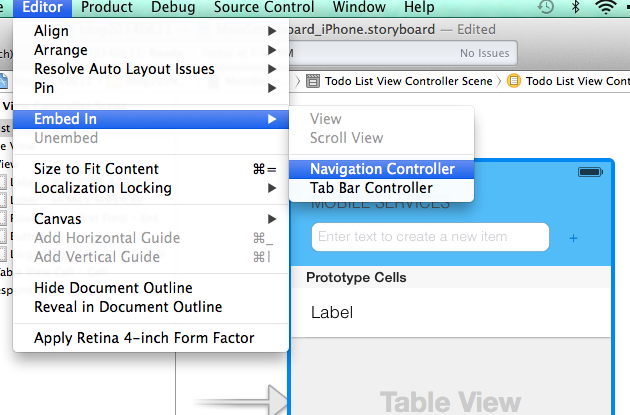
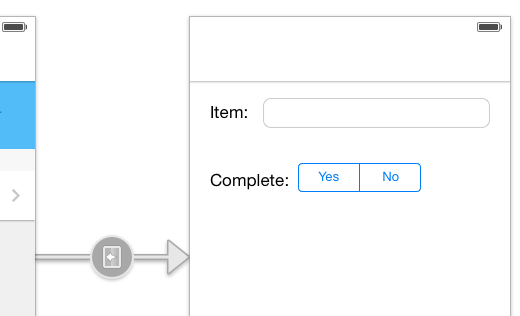

# conflict handling

## Update the UI to make items editable

Here are the steps needed to change the existing Todo list app downloaded from the Azure portal to make the items editable.

### Updating the navigation view

This tutorial walks through the changes for the iPhone storyboard only, but you would make similar changes to the iPad version. 

1. In Xcode, open the MainStoryboard_iPhone.storyboard file. Select the main view controller, and on the Editor menu, select "Embed In", "Navigation Controller".

2. Select the table view cell in the Todo List View Controller and in the properties window set the Accessory mode to be **Disclosure Indicator**.

### Adding the details view controller

1. Add a new Objective-C class called `QSTodoItemViewController`, derived from `UIViewController`.

2. In the new header `QSTodoItemViewController.h`, add a property of type NSMutableDictionary, which will hold the item to be modified:

	    @interface QSTodoItemViewController : UIViewController <UITextFieldDelegate>

	    @property (nonatomic, weak) NSMutableDictionary *item;

	    @end

3. In `QSTodoItemViewController.m`, add two private properties corresponding to the fields of the todo item being edited:

	    @interface QSTodoItemViewController ()

	    @property (nonatomic, strong) IBOutlet UITextField *itemText;
	    @property (nonatomic, strong) IBOutlet UISegmentedControl *itemComplete;

	    @end

	    @implementation QSTodoItemViewController

	    - (id)initWithNibName:(NSString *)nibNameOrNil bundle:(NSBundle *)nibBundleOrNil
	    {
	        self = [super initWithNibName:nibNameOrNil bundle:nibBundleOrNil];
	        if (self) {
	            // Custom initialization
	        }
	        return self;
	    }

	    - (void)viewDidLoad
	    {
	        [super viewDidLoad];

	        UINavigationItem *nav = [self navigationItem];
	        [nav setTitle:@"Todo Item"];

	        NSDictionary *theItem = [self item];
	        [self.itemText setText:[theItem objectForKey:@"text"]];

	        BOOL isComplete = [[theItem objectForKey:@"complete"] boolValue];
	        [self.itemComplete setSelectedSegmentIndex:(isComplete ? 0 : 1)];

	        [self.itemComplete addTarget:self
	                              action:@selector(completedValueChanged:)
	                    forControlEvents:UIControlEventValueChanged];
	    }

	    - (void)completedValueChanged:(id)sender {
	        [[self view] endEditing:YES];
	    }

	    - (void)viewWillDisappear:(BOOL)animated {
	        [self.item setValue:[self.itemText text] forKey:@"text"];
	        [self.item setValue:[NSNumber numberWithBool:self.itemComplete.selectedSegmentIndex == 0] forKey:@"complete"];
	    }

	    - (void)didReceiveMemoryWarning
	    {
	        [super didReceiveMemoryWarning];
	        // Dispose of any resources that can be recreated.
	    }

	    - (BOOL)textFieldShouldEndEditing:(UITextField *)textField {
	        [textField resignFirstResponder];
	        return YES;
	    }

	    - (BOOL)textFieldShouldReturn:(UITextField *)textField {
	        [textField resignFirstResponder];
	        return YES;
	    }

	    @end

4. Return to the storyboard and add a new view controller to the right of the list view. 

5. In the identity inspector, select `QSTodoItemViewController` as the custom class for the view controller. 

6. A new push segue from the master view controller to the detail view controller and name the segue `detailSegue`. 

7. Add a `UITextField` and `UISegmentedControl` to the view controller. 

8. Link the new controls to the outlets in `QSTodoItemViewController`.

9. Run the app. When selecting an item in the table, it will show the (currently empty) details view controller.

### Filling the detail view

Now we need to pass the item from the master to the detail view, and update it once we're back. 

1. Delete the following methods which are no longer needed:

		tableView:titleForDeleteConfirmationButtonForRowAtIndexPath:
		tableView:editingStyleForRowAtIndexPath:
		tableView:commitEditingStyle:forRowAtIndexPath:

2. In `QSTodoListViewController.m`, add two new properties which will be used to store the item being edited: `editedItem` and `editedItemIndex`:

    @interface QSTodoListViewController ()

    // Private properties
    @property (strong, nonatomic)   QSTodoService   *todoService;
    @property (nonatomic)           BOOL            useRefreshControl;
    @property (nonatomic)           NSInteger       editedItemIndex;
    @property (strong, nonatomic)   NSMutableDictionary *editedItem;

    @end

3. Implement the method `tableView:didSelectRowAtIndexPath:` to save the item being edited and call the segue to display the detail view.

    - (void)tableView:(UITableView *)tableView didSelectRowAtIndexPath:(NSIndexPath *)indexPath {
        self.editedItemIndex = [indexPath row];
        self.editedItem = [[self.todoService.items objectAtIndex:[indexPath row]] mutableCopy];

        [self performSegueWithIdentifier:@"detailSegue" sender:self];
    }

4. Implement the `prepareForSegue:sender:` selector to pass the item to the next controller.

    - (void)prepareForSegue:(UIStoryboardSegue *)segue sender:(id)sender {
        if ([[segue identifier] isEqualToString:@"detailSegue"]) {
            QSTodoItemViewController *ivc = (QSTodoItemViewController *)[segue destinationViewController];
            ivc.item = self.editedItem;
        }
    }

You should now be able to run the app and see the item displayed in the detail view.

### Saving the edits

When you click the "Back" button in the navigation view the edits are lost. We've sent data to the detail view, but the data isn't being sent back to the master. Ideally we'd implement a delegate in the master view controller so that it can be notified when edits are done, but since we already passed a pointer to a copy of the item that is being edited, we can use that pointer to retrieve the list of updates made to the item and update it in the server.

But before changing the todo list view controller, we need to update the server wrapper class (`QSTodoService`), since it doesn't have a method to update items (it only has a method to mark an item as complete). Remove the method `completeItem:completion:`, and add the method below (declaration in the header file omitted)

    - (void)updateItem:(NSDictionary *)item atIndex:(NSInteger)index completion:(QSCompletionWithIndexBlock)completion {
        // Cast the public items property to the mutable type (it was created as mutable)
        NSMutableArray *mutableItems = (NSMutableArray *) items;

        // Replace the original in the items array
        [mutableItems replaceObjectAtIndex:index withObject:item];

        // Update the item in the TodoItem table and remove from the items array on completion
        [self.table update:item completion:^(NSDictionary *updatedItem, NSError *error) {
            [self logErrorIfNotNil:error];

            NSInteger index = -1;
            if (!error) {
                BOOL isComplete = [[updatedItem objectForKey:@"complete"] boolValue];
                NSString *remoteId = [updatedItem objectForKey:@"id"];
                index = [items indexOfObjectPassingTest:^BOOL(id obj, NSUInteger idx, BOOL *stop) {
                    return [remoteId isEqualToString:[obj objectForKey:@"id"]];
                }];

                if (index != NSNotFound && isComplete)
                {
                    [mutableItems removeObjectAtIndex:index];
                }
            }

            // Let the caller know that we have finished
            completion(index);
        }];
    }

Now that we can update items on the server, we can implement the `viewWillAppear:` method to call the update method when the master view is being displayed while returning from the details view controller.

    - (void)viewWillAppear:(BOOL)animated {
        if (self.editedItem && self.editedItemIndex >= 0) {
            // Returning from the details view controller
            NSDictionary *item = [self.todoService.items objectAtIndex:self.editedItemIndex];

            BOOL changed = ![item isEqualToDictionary:self.editedItem];
            if (changed) {
                [self.tableView setUserInteractionEnabled:NO];

                // Change the appearance to look greyed out until we remove the item
                NSIndexPath *indexPath = [NSIndexPath indexPathForRow:self.editedItemIndex inSection:0];

                UITableViewCell *cell = [self.tableView cellForRowAtIndexPath:indexPath];
                cell.textLabel.textColor = [UIColor grayColor];

                // Ask the todoService to update the item, and remove the row if it's been completed
                [self.todoService updateItem:self.editedItem atIndex:self.editedItemIndex completion:^(NSUInteger index) {
                    if ([[self.editedItem objectForKey:@"complete"] boolValue]) {
                        // Remove the row from the UITableView
                        [self.tableView deleteRowsAtIndexPaths:@[ indexPath ]
                                              withRowAnimation:UITableViewRowAnimationTop];
                    } else {
                        [self.tableView reloadRowsAtIndexPaths:[NSArray arrayWithObject:indexPath]
                                              withRowAnimation:UITableViewRowAnimationAutomatic];
                    }

                    [self.tableView setUserInteractionEnabled:YES];

                    self.editedItem = nil;
                    self.editedItemIndex = -1;
                }];
            } else {
                self.editedItem = nil;
                self.editedItemIndex = -1;
            }
        }
    }

## Update QSTodoService

1. In `QSTodoService.h`, Remove the existing `defaultService` declaration and replace it with the declaration below. This adds a parameter for the conflict handler delegate:

		+ (QSTodoService *)defaultServiceWithDelegate:(id<MSSyncContextDelegate>)delegate;

2. In `QSTodoService.m`, remove the `defaultService` definition and add the following method:

		+ (QSTodoService *)defaultServiceWithDelegate:(id<MSSyncContextDelegate>)delegate
		{
		    // Create a singleton instance of QSTodoService
		    static QSTodoService* service;
		    static dispatch_once_t onceToken;
		    dispatch_once(&onceToken, ^{
		        service = [[QSTodoService alloc] initWithDelegate:delegate];
		    });
		    
		    return service;
		}

3. Rename the private constructor `init` to `initWithDelegate` and add a parameter for the delegate:

	-(QSTodoService *)initWithDelegate:(id<MSSyncContextDelegate>)syncDelegate

4. In the implementation of `initWithDelegate`, change the initialization of the sync context to pass the delegate:

	self.client.syncContext = [[MSSyncContext alloc] initWithDelegate:syncDelegate dataSource:store callback:nil];

## Update QSListViewController

Now we will implement the UI changes for showing a conflict handling dialog to the user. If there is a server conflict, the dialog allows the user to choose which version of a todo item they want to keep: the client version (which will then overwrite the version on the server), the server version (whose value will remain unchanged, and the client version will be overwritten), or cancel the entire push operation, leaving the remaining push operations pending. 

During conflict handling, more conflicts can arise (for instance, server updates may have occurred in the interim), so the code needs to keep showing the options until the server returns success. 

1. In `QSTodoListViewController.h`, change the interface declaration to implement the MSSyncContextDelegate protocol:

	@interface QSTodoListViewController : UITableViewController <MSSyncContextDelegate>

2. In `QSTodoListViewController.m`, change the implementation of `viewDidLoad` to pass the self pointer to the delegate when initializing the todoService property:

	// Create the todoService - this creates the Mobile Service client inside the wrapped service
	self.todoService = [QSTodoService defaultServiceWithDelegate:self];

3. Implement the `tableOperation:onComplete:` method, which will be called for every item which is being sent (pushed) to the service. Here we will show the user a conflict handling dialog:

		- (void)tableOperation:(MSTableOperation *)operation onComplete:(MSSyncItemBlock)completion
		{
		    [self doOperation:operation complete:completion];
		}

		- (void)doOperation:(MSTableOperation *)operation complete:(MSSyncItemBlock)completion
		{
		    [operation executeWithCompletion:^(NSDictionary *item, NSError *error) {
		        
		        NSDictionary *serverItem = [error.userInfo objectForKey:MSErrorServerItemKey];
		        
		        if (error.code == MSErrorPreconditionFailed) {
		            QSUIAlertViewWithBlock *alert = [[QSUIAlertViewWithBlock alloc] initWithCallback:^(NSInteger buttonIndex) {
		                if (buttonIndex == 1) { // Client
		                    NSMutableDictionary *adjustedItem = [operation.item mutableCopy];
		                    
		                    [adjustedItem setValue:[serverItem objectForKey:MSSystemColumnVersion] forKey:MSSystemColumnVersion];
		                    operation.item = adjustedItem;
		                    
		                    [self doOperation:operation complete:completion];
		                    return;
		                    
		                } else if (buttonIndex == 2) { // Server
		                    NSDictionary *serverItem = [error.userInfo objectForKey:MSErrorServerItemKey];
		                    completion(serverItem, nil);
		                } else { // Cancel
		                    [operation cancelPush];
		                    completion(nil, error);
		                }
		            }];
		            
		            NSString *message = [NSString stringWithFormat:@"Client value: %@\nServer value: %@", operation.item[@"text"], serverItem[@"text"]];

		            
		            [alert showAlertWithTitle:@"Server Conflict"
		                              message:message
		                    cancelButtonTitle:@"Cancel"
		                    otherButtonTitles:[NSArray arrayWithObjects:@"Use Client", @"Use Server", nil]];
		        } else {
		            completion(item, error);
		        }
		    }];
		}

